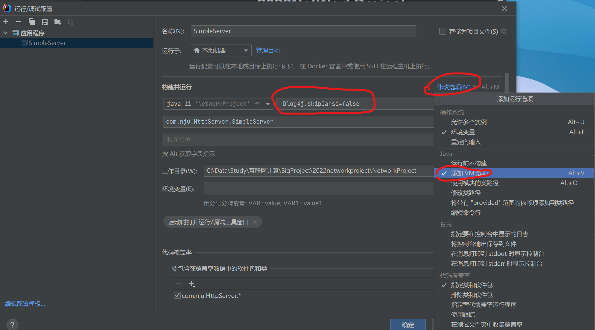

## Http-Server

### 项目要求

实现基础的 HTTP 请求、响应功能，具体要求如下：

- HTTP 服务器端支持 GET 和 POST 请求 
- HTTP 服务器端支持 200、301、302、304、404、405、500 的状态码 
- HTTP 服务器端实现长连接
- MIME 至少支持三种类型，包含一种非文本类型 

### Before Start

本项目使用了`log4j2`记录日志，为保证控制台日志信息**有颜色**，请先设置JVM参数：`-Dlog4j.skipJansi=false`

运行后，打开http://localhost:5000/index.html ,出现一个带图片的注册登录页面，说明项目配置正常。

### 项目简介

SimpleServer类负责启动主线程ServerHandler以监听请求。监听到连接请求，回调AcceptHandler，AcceptHandler回调RequestHandler处理Http信息。
Http包负责封装请求和响应。Controller包负责匹配路径并分发指令（如GET静态资源等），其中RequestMapper是仿Springboot风格的uri匹配器，内含的Router包是uri匹配器的具体实现。Services包负责处理业务逻辑，生成http响应。
Common包存放状态码等枚举。StaticResouces文件夹下放了一个演示网页。

### Todo:

- **已实现2022.4.15**：实现http请求和响应的封装

- **已修复2022.4.17**：修复`keep-alive`问题（定时断开连接的实现），主要在`RequestHandler`和`AcceptHandler`类中修改。
  问题复现：多次硬刷新页面，可以看到IOException，猜测可能是连接断开时机的问题。
- **已实现2022.4.18**：实现类Spring Controller模式的路径匹配器
- **已完成2022.5.28**：精简Controller，Services
- **已修复**：304无效的bug，原因：日期的比较精度
- **已测试2022.6.13**